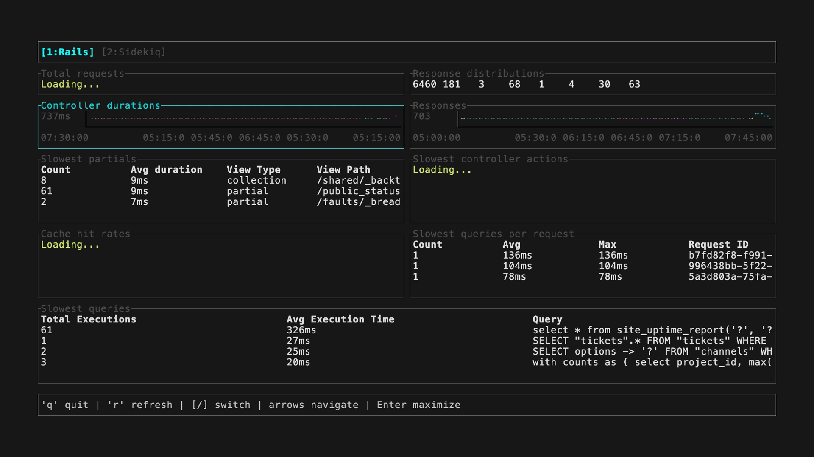

# hbtui

A terminal dashboard for [Honeybadger Insights](https://www.honeybadger.io/tour/logging-observability/), built with Rust. Query and visualize your application data—errors, performance, logs, custom events—right from your command line.



## Installation

### From source

```bash
cargo install --path .
```

### Homebrew (macOS/Linux)

```bash
brew install honeybadger-io/tap/hbtui
```

### Shell installer (macOS/Linux)

```bash
curl --proto '=https' --tlsv1.2 -LsSf https://github.com/honeybadger-io/hbtui/releases/latest/download/hbtui-installer.sh | sh
```

### Pre-built binaries

Download from [GitHub Releases](https://github.com/honeybadger-io/hbtui/releases).

## Usage

```bash
# With command-line flags
hbtui -p <PROJECT_ID> --auth-token <TOKEN>

# With environment variables
export HONEYBADGER_PROJECT_ID=12345
export HONEYBADGER_PERSONAL_AUTH_TOKEN=your_token
hbtui

# Custom dashboard file or directory
hbtui -p 12345 -d ./my-dashboard.yml
hbtui -p 12345 -d ./dashboards/
```

### Options

| Flag               | Env Variable                      | Description                                        |
| ------------------ | --------------------------------- | -------------------------------------------------- |
| `-p, --project-id` | `HONEYBADGER_PROJECT_ID`          | Honeybadger project ID (required)                  |
| `--auth-token`     | `HONEYBADGER_PERSONAL_AUTH_TOKEN` | API auth token (required)                          |
| `-d, --dashboards` | `HONEYBADGER_DASHBOARDS`          | Dashboard file or directory                        |
| `--endpoint`       | `HONEYBADGER_ENDPOINT`            | API endpoint (default: https://app.honeybadger.io) |
| `-h, --help`       |                                   | Print help                                         |
| `-V, --version`    |                                   | Print version                                      |

#### EU Region

If your Honeybadger account is in the [EU region](https://docs.honeybadger.io/resources/data-residency/), use:

```bash
hbtui -p 12345 --endpoint https://eu-app.honeybadger.io
```

Dashboards display the last 3 hours of data (`PT3H`).

### Dashboard Locations

If `-d` is not specified, hbtui looks for dashboards in order:

1. `./.hbtui/dashboards/` (project-local)
2. `~/.hbtui/dashboards/` (user default)

## Key Bindings

| Key        | Action                            |
| ---------- | --------------------------------- |
| `q`        | Quit                              |
| `r`        | Refresh current dashboard         |
| `[` / `]`  | Previous / next dashboard         |
| `1-9`      | Jump to dashboard by number       |
| Arrow keys | Navigate widgets                  |
| `Enter`    | Maximize selected widget          |
| `Esc`      | Exit maximized view               |
| `Up/Down`  | Filter by series (when maximized) |

## Dashboards

Dashboards are YAML files that define widgets powered by [Honeybadger Insights](https://docs.honeybadger.io/guides/insights/). See the [Dashboards guide](https://docs.honeybadger.io/guides/dashboards/#editing-dashboard-source) to learn how to export your dashboard YAML.

### Example

```yaml
title: My Dashboard
widgets:
  - id: requests
    type: insights
    grid: { x: 0, y: 0, w: 6, h: 2 }
    presentation:
      title: Requests per Hour
    config:
      query: |
        SELECT count(*) as count, bin(ts, 1h) as time
        FROM requests
        GROUP BY time
        ORDER BY time
      vis:
        view: line
        chart_config:
          xField: time
          yField: count

  - id: errors
    type: insights
    grid: { x: 6, y: 0, w: 6, h: 2 }
    presentation:
      title: Errors by Class
    config:
      query: |
        SELECT count(*) as count, class
        FROM errors
        GROUP BY class
        ORDER BY count DESC
        LIMIT 10
      vis:
        view: table
```

### Grid System

Widgets are positioned on a 12-column grid:

- `x`: Column position (0-11)
- `y`: Row position (0+)
- `w`: Width in columns (1-12)
- `h`: Height in rows

### Visualization Types

| Type        | Description                         |
| ----------- | ----------------------------------- |
| `line`      | Time-series line chart              |
| `histogram` | Bar chart (supports stacked series) |
| `table`     | Data table                          |
| `billboard` | Large single-value display          |

### Chart Config

```yaml
chart_config:
  xField: time # X-axis field
  yField: count # Y-axis field
  zField: status # Series grouping (optional)
  yFieldUnit: milliseconds # Unit for Y-axis (optional)
```

## Development

```bash
cargo build          # Build
cargo run -- --help  # Run with args
cargo test           # Run tests
cargo clippy         # Lint
cargo fmt            # Format
```

## Releasing

Releases are automated via [cargo-dist](https://opensource.axo.dev/cargo-dist/). To create a release:

```bash
git tag v0.1.0
git push origin main --tags
```

This will:

- Build binaries for macOS (Intel + ARM), Linux, and Windows
- Create a GitHub Release with all artifacts
- Generate shell installer script
- Update the Homebrew tap

## License

MIT
